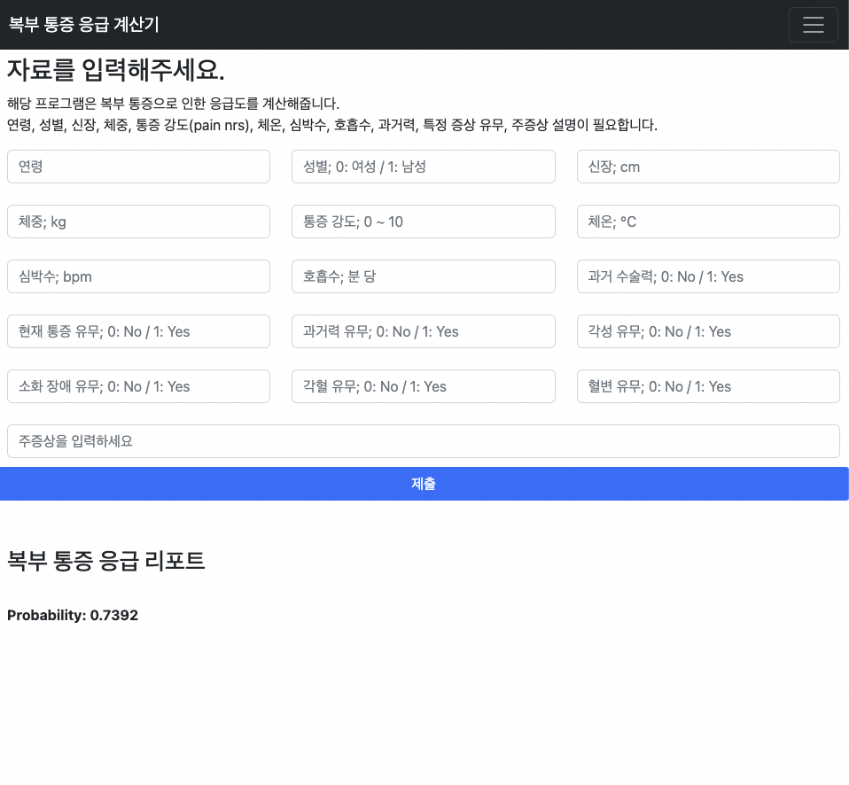
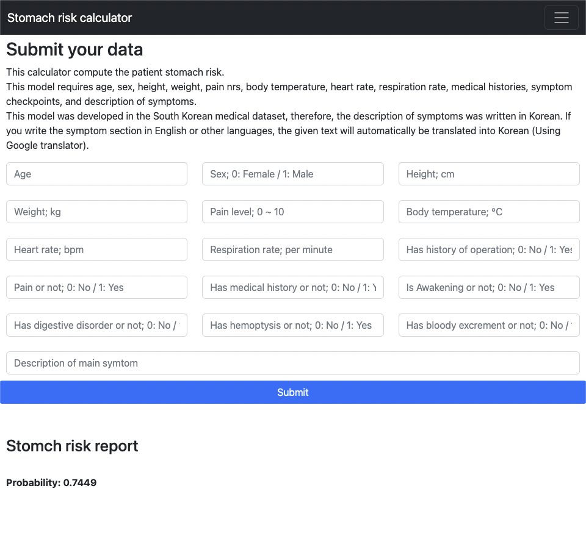

# 복통 분류 API

- Flask API 서버
    - Python 3.8.3, Flask 2.2.2

- 설치 및 실행
    - `sh install_mecab.sh`
    - `pip install -r requirments.txt`
    - `python app.py` (ENG)
    - `python app_kor.py` (KOR)

- 사용법
    - 웹페이지에서 적절한 항목을 기입합니다.
        - age: 나이
        - sex: 성별 (0: 여, 1: 남)
        - height: 신장 (cm)
        - weight: 체중 (kg)
        - pain_nrs: 통증 점수 (1~10)
        - temperature: 체온
        - pulse: 맥박
        - respiration: 호흡
        - symtom: 주증상
        - is_operation: 과거 수술력
        - is_pain: 통증 유무 (0: N / 1: Y)
        - is_medical_history: 과거 병력 (0: N / 1: Y)
        - is_alertness: 의식 유무 (0: N / 1: Y)
        - is_digestive: 소화기계 이상 (0: N / 1: Y)
        - is_hemoptysis: 각혈 유무 (0: N / 1: Y)
        - is_blood_excrement: 혈변 유무 (0: N / 1: Y)
    - 해당 결과를 Xgboost 모델이 위험도를 계산합니다.

- 결과
    - 한글 버전
      - 
    - 영어 버전
      - 